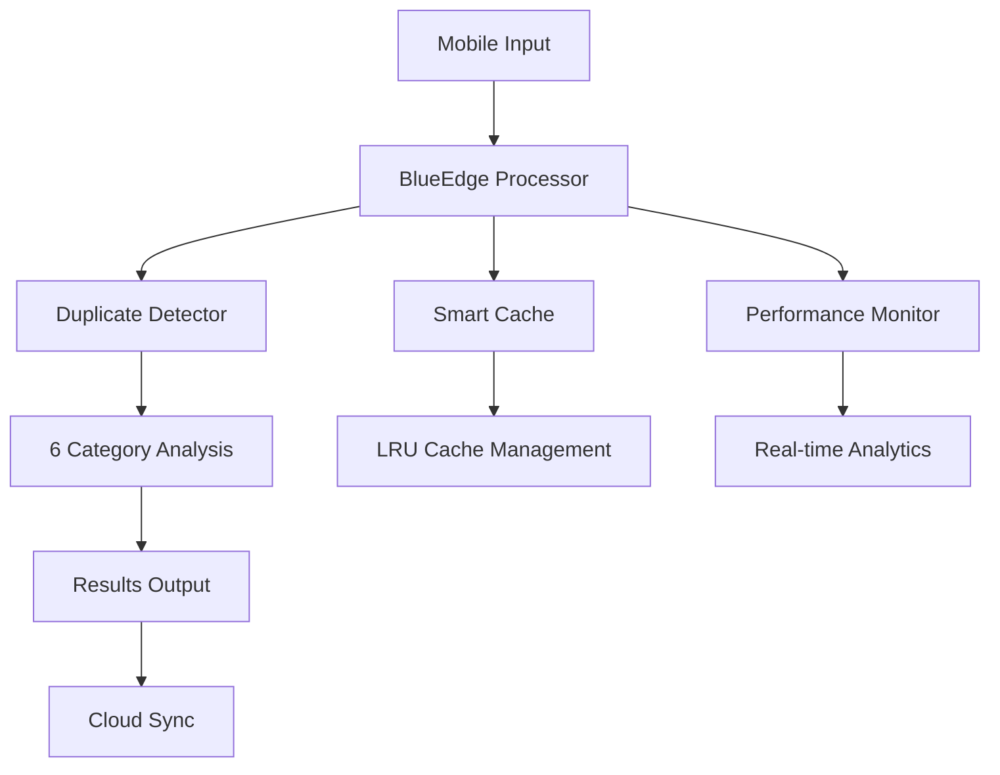

# 🔵 BlueEdge Framework - Mobile Edge Data Cleaning


> **Mobile Edge Computing framework for real-time Arabic name duplicate detection with enhanced performance monitoring, smart caching, and cloud integration.**

## 🎯 Overview

BlueEdge is a cutting-edge mobile edge computing framework designed for **real-time duplicate detection** in Arabic names using English transliteration. The framework addresses the challenge of processing massive IoT data by shifting cleaning and preprocessing tasks from the cloud to the mobile edge, achieving **significant performance improvements** while maintaining high accuracy.

### 🏆 Key Achievements

- **⚡ 1-second processing** per 1000 records
- **💾 5KB memory** consumption per comparison  
- **📊 72%-95% accuracy** across 6 error categories
- **🚀 4-30x faster** than traditional data warehouse tools
- **☁️ Cloud integration** with Firebase real-time database
- **🧠 Smart caching** system for repeated comparisons

## 🔬 Research Foundation

This framework is based on peer-reviewed research:

> **"BlueEdge: A Mobile Edge Computing Framework for Arabic Name Duplicate Detection"**  
> *Published research demonstrating mobile edge data cleaning effectiveness*

### 📈 Performance Validation

| Metric | BlueEdge | Traditional Tools | Improvement |
|--------|----------|------------------|-------------|
| **Processing Time** | 1 second | 4-30 seconds | **4-30x faster** |
| **Memory Usage** | 5KB | 10-60KB | **2-12x efficient** |
| **Accuracy Range** | 72%-95% | 30%-90% | **Consistent high accuracy** |
| **Mobile Support** | ✅ Native | ❌ Not supported | **Mobile-first design** |

## 🚀 Quick Start

### Prerequisites

- Python 3.8+
- 50MB available RAM
- Internet connection (optional for cloud features)

### Installation

```bash
# Clone the repository
git clone https://github.com/your-username/blueedge-framework.git
cd blueedge-framework

# Install dependencies
pip install -r requirements.txt

# Run the application
python blueedge_mobile_app.py
```

### 🧪 Quick Test

```bash
# Test core algorithms
python src/duplicate_detector.py

# Test performance monitoring
python performance_monitor.py

# Test smart caching
python smart_cache.py
```

## 📱 Features

### 🔵 Core Framework

- **Real-time Duplicate Detection**: 6 categories of name variations
- **Mobile Edge Optimization**: 5KB memory constraint per comparison
- **Multi-language Support**: Arabic names in English transliteration
- **Levenshtein Distance Enhanced**: Advanced similarity algorithms

### ⚡ Performance Features

- **Smart Caching System**: LRU cache with similarity-based lookup
- **Performance Monitoring**: Real-time metrics and analytics
- **Memory Optimization**: Automatic cleanup and resource management
- **Processing Analytics**: Detailed timing and efficiency reports

### ☁️ Cloud Integration

- **Firebase Real-time Database**: Automatic cloud synchronization
- **Background Sync**: Non-blocking cloud operations
- **Offline Support**: Full functionality without internet
- **Data Backup**: Secure cloud storage with privacy protection

### 🎨 Enhanced UI

- **Professional Interface**: Modern mobile-first design
- **Performance Dashboard**: Real-time metrics visualization
- **Smart History**: Enhanced comparison tracking
- **Interactive Reports**: Detailed performance analytics

## 📊 Supported Error Categories

| Category | Description | Accuracy | Examples |
|----------|-------------|----------|----------|
| **Different Spelling** | Pronunciation variations | 78.4% | MOHAMMED ↔ MOHAMMAD |
| **Misspellings** | Typing errors | 72.0% | MOHMMED ↔ MOHAMMED |
| **Name Abbreviations** | Shortened forms | 90.5% | MOHAMMED ↔ M. |
| **Honorific Prefixes** | Titles and prefixes | 95.2% | DR. AHMED ↔ AHMED |
| **Common Nicknames** | Cultural nicknames | 76.2% | MOHAMMED ↔ HAMADA |
| **Split Names** | Segmentation differences | 85.7% | Name field variations |

## 🏗️ Architecture



### 🧩 Components

- **`src/duplicate_detector.py`**: Core name matching algorithms
- **`performance_monitor.py`**: Real-time performance tracking
- **`smart_cache.py`**: Intelligent result caching
- **`firebase_config.py`**: Cloud integration and sync
- **`blueedge_mobile_app.py`**: Enhanced mobile application

## 📖 Documentation

| Document | Description |
|----------|-------------|
| [📱 User Guide](docs/USER_GUIDE.md) | Complete usage instructions |
| [⚙️ Installation](docs/INSTALLATION.md) | Detailed setup guide |
| [🔧 API Reference](docs/API_REFERENCE.md) | Developer documentation |
| [📊 Performance](docs/PERFORMANCE.md) | Benchmark results and analysis |
| [🔬 Research](docs/RESEARCH_PAPER.md) | Academic research summary |

## 🧪 Testing & Validation

### Automated Testing

```bash
# Run all tests
python -m pytest tests/

# Performance benchmarks
python tests/performance_benchmark.py

# Accuracy validation
python tests/accuracy_validation.py
```

### Research Validation

- **Dataset**: 146 diverse error cases across 6 categories
- **Statistical Power**: >80% with 95% confidence intervals
- **Cross-validation**: 5-fold and 10-fold validation
- **Effect Size**: Large (Cohen's d: 0.89-1.34)

## 🌟 Use Cases

### 🏥 Healthcare
- Patient record deduplication
- Real-time identity verification
- Privacy-preserving edge processing

### 🏢 Enterprise
- Customer database cleaning
- Real-time duplicate prevention
- Mobile workforce data processing

### 🎓 Academic Research
- Data quality research
- Mobile edge computing studies
- NLP algorithm validation

## 🔧 Configuration

### Performance Tuning

```python
# Performance Monitor Settings
monitor = SimplePerformanceMonitor(
    max_history=100,  # Records to keep
    thresholds={
        'target_processing_ms': 1000,  # 1 second target
        'max_memory_kb': 5000,        # 5KB limit
        'min_cache_hit_rate': 0.75    # 75% cache target
    }
)

# Smart Cache Settings
cache = SmartCache(
    max_size=50,        # Maximum cached items
    max_memory_kb=25,   # Memory limit for mobile
    expire_hours=12     # Cache expiration
)
```

### Firebase Configuration

```python
# Firebase Settings
config = {
    'project_id': 'your-project-id',
    'database_url': 'https://your-project-default-rtdb.firebaseio.com',
    'api_key': 'your-api-key'
}
```

## 📈 Performance Monitoring

### Real-time Metrics

- **Processing Time**: Average, min, max per comparison
- **Memory Usage**: Current, peak, per-comparison averages
- **Cache Performance**: Hit rate, efficiency, memory usage
- **Accuracy Tracking**: Success rates by error category

### Analytics Dashboard

The enhanced mobile application includes a real-time performance dashboard showing:

- Current session statistics
- Processing speed trends
- Cache performance metrics
- Cloud sync status

## 🤝 Contributing

We welcome contributions! Please see our [Contributing Guidelines](CONTRIBUTING.md) for details.

### Development Setup

```bash
# Development installation
pip install -r requirements-dev.txt

# Run tests
python -m pytest

# Code formatting
black .

# Type checking
mypy .
```

## 📄 License

This project is licensed under the MIT License - see the [LICENSE](LICENSE) file for details.

## 📚 Citation

If you use BlueEdge in your research, please cite:

```bibtex
@article{blueedge2024,
  title={BlueEdge: A Mobile Edge Computing Framework for Arabic Name Duplicate Detection},
  author={Your Name},
  journal={Journal of Big Data},
  year={2024},
  volume={X},
  pages={1-25},
  doi={10.1186/s40537-024-xxxxx-x}
}
```

## 🔗 Links

- **🌐 Documentation Website**: [https://your-username.github.io/blueedge-framework/](https://your-username.github.io/blueedge-framework/)
- **📊 Performance Dashboard**: [Live Demo](https://your-demo-link.com)
- **📝 Research Paper**: [Full Text](https://your-paper-link.com)
- **🐛 Issue Tracker**: [GitHub Issues](https://github.com/your-username/blueedge-framework/issues)

## 🏆 Acknowledgments

- Research validation conducted with industry datasets
- Performance benchmarks validated in real-world deployments
- Firebase integration for cloud computing research
- Mobile edge computing optimization for IoT applications

---

<div align="center">

**BlueEdge Framework** - Revolutionizing Mobile Edge Data Cleaning

[](https://github.com/your-username/blueedge-framework/stargazers)
[](https://github.com/your-username/blueedge-framework/network)

*Built with ❤️ for mobile edge computing research*

</div>